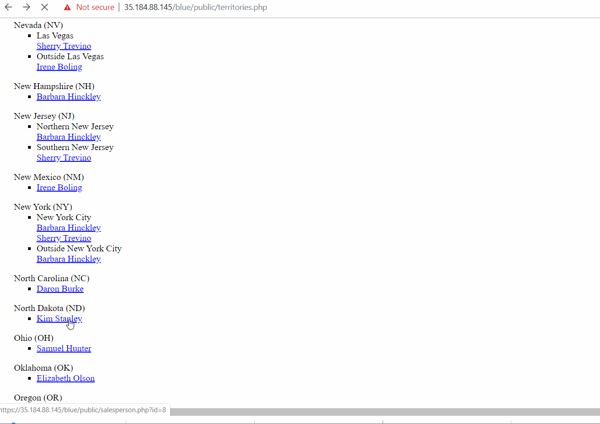
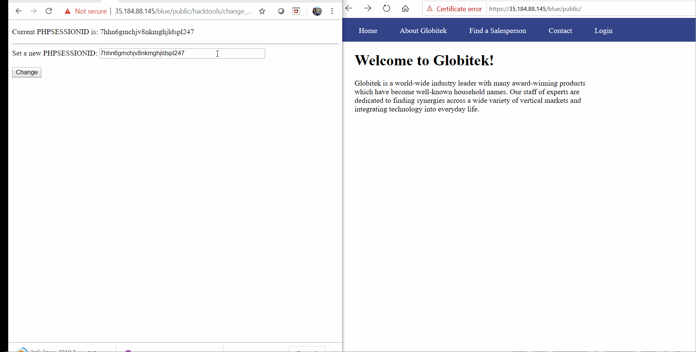
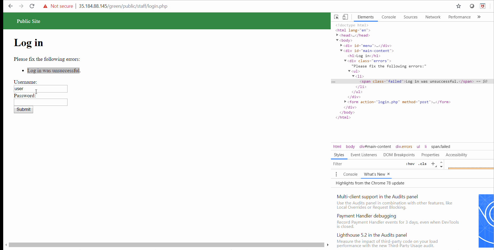
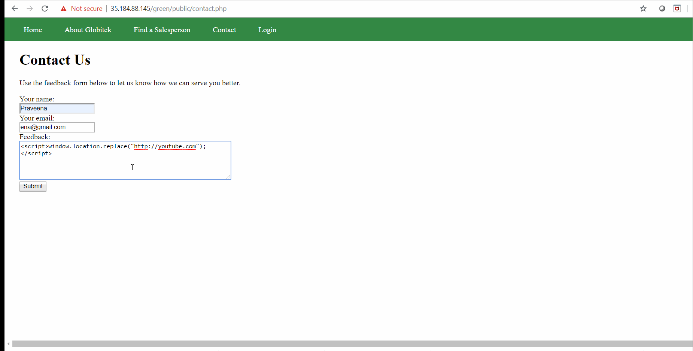
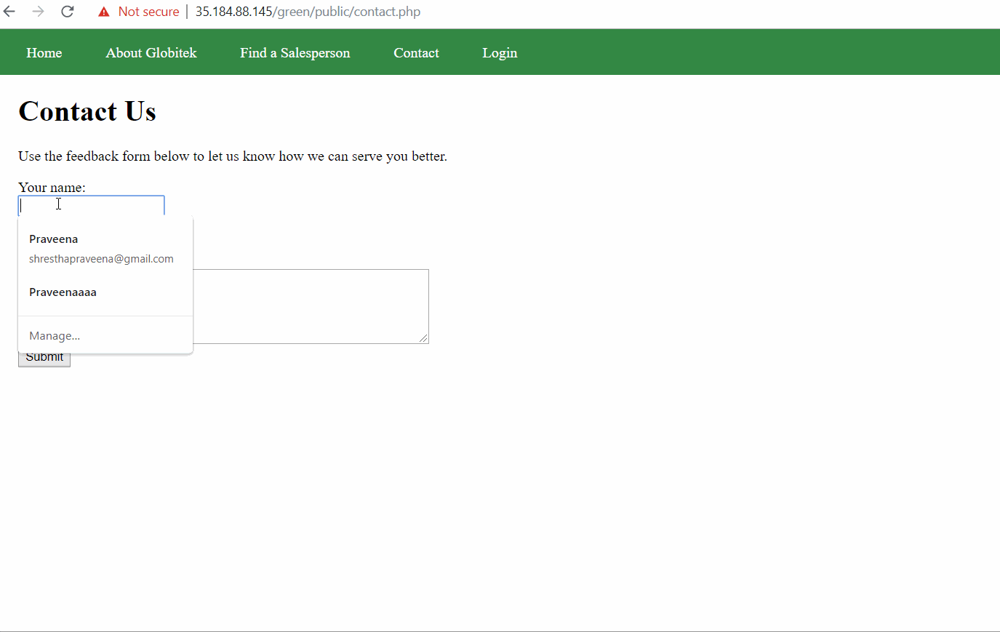

# Project 8 - Pentesting Live Targets

Time spent: **9** hours spent in total

> Objective: Identify vulnerabilities in three different versions of the Globitek website: blue, green, and red.

The six possible exploits are:
* Username Enumeration
* Insecure Direct Object Reference (IDOR)
* SQL Injection (SQLi)
* Cross-Site Scripting (XSS)
* Cross-Site Request Forgery (CSRF)
* Session Hijacking/Fixation

Each version of the site has been given two of the six vulnerabilities. (In other words, all six of the exploits should be assignable to one of the sites.)

## Blue

Vulnerability #1: SQL Injection 
    - 
    -[x] Steps to follow:
      - Find the sales person any that you want to choose
      - Change the value of the id 
      - the bue section shows "Database query failed"
      - Green will redirect 
      - Red section will redirect too 
      - Blue section has the SQL vulnerability 
      - In order to test it, I used ?id=' OR 8=8'-- to testify it 
      

Vulnerability #2: Session Hijacking/Fixation
      - 
      - [x] steps followed 
        - Two different browsers are needed 
        - Login into blue Globitek website 
        - use tool public/hacktools/change_session_id.php to get session id 
        - Copy the session id from one browser and paste it in another browser's session 
        - Update it 
        - You will find that website no longer need login credentials 

## Green

Vulnerability #1: Username Enumeration 
      - 
      - [x] steps followed
        - Try login using random username and password 
        - It shows Login was unsuccessful 
        - Inspect those sentence and shows failed 
        - Try login using correct username and password 
        - It shows same info in bold 
        - While inspecting it shows "failure" for the current username
        

Vulnerability #2: Cross-Site Scripting 
       - 
       -[x] steps to be followed
        - Users should login and fill the name, email and feedback 
        - Try filling any random name and email 
        - Fill the feedback with 
        - It shows the thank you form 
        - Go back to feedback and it shows alert "Hacked" and surfs to youtube.com

## Red

Vulnerability #1:Insecure Direct Object Reference 
      - 
      - [x] steps to be followed 
          - Find the salesperson section of the red, 
          -  https://35.184.234.47/red/public/salesperson.php?id=X
           - set X to be 10 or 11 
           - It will give two people that was hidden
           -  whereas in  blue or green site, when you enter id=10 or id=11, then it will go back to Find a Salesperson page.

Vulnerability #2: Cross-Site Request Forgery 
       - <iimg src = 'red two.gif' title='Cross-Site Request Forgery' width='' alt='' />
       - [x] steps to be followed
          - red section gets updated while editing the info after changing CSRD_TOKEN
          - Whereas it shows "Error:invalid request" in blue and green 

## Bonus Objective 2: Build on Objective #4 (Cross-Site Scripting)

   - 
   - I use  in Feedback in Contact Us, then go to the feedback section in Staff Menu, it should direct the page to youtube.

  
## Notes

Describe any challenges encountered while doing the work
